<div align="center">


<a href="https://git.io/typing-svg">
  
</a>

<br/>


<br/>

[](https://github.com/ayushxdev01)
[](https://www.linkedin.com/in/ayushgupta3105/)
[](mailto:a005gupta456@gmail.com)
[](https://github.com/ayushxdev01)

<br/>


</div>

<br/>

---

## 🧠 About Me


I'm a **Computer Science Engineering** student and aspiring **Software / AI-ML Engineer**, focused on building production-grade systems at the intersection of **Artificial Intelligence, Computer Vision, NLP, and Full-Stack Development**.

- 🔭 I engineer end-to-end AI systems — from LLM-powered pipelines to real-time computer vision applications.
- 🧩 Strong foundation in **DSA, OOPs, DBMS, Operating Systems, and Machine Learning**.
- ⚙️ I care about **latency, accuracy, and scalability** — not just "does it work," but "does it work at scale."
- 🌱 Actively exploring **LLM orchestration, embedded IoT systems, and cloud-native deployment**.
- 💡 Product-engineering mindset — I build tools that solve real business problems (inventory, hiring, surveillance, governance feedback).

**🎯 Open To:** Software Development Engineer (SDE) Roles • AI/ML Engineer Roles • Data Analyst Roles • Research Collaborations • Open Source Contributions

<br clear="right"/>

---

## 🛠️ Tech Stack

**Languages**


**Frontend**


**Backend & Databases**


**Cloud, DevOps & Tooling**


---

## 🤖 AI / ML Expertise

<div align="center">

| Domain | Proficiency | Details |
|:------:|:-----------:|:--------|
| **Natural Language Processing (NLP)** | ⭐⭐⭐⭐☆ | Tokenization, stemming, vectorization, sentiment classification, prompt engineering with Llama/Gemini models |
| **Computer Vision** | ⭐⭐⭐⭐☆ | Real-time object detection (YOLOv8), OCR pipelines (EasyOCR), video/webcam stream processing |
| **LLM Integration** | ⭐⭐⭐⭐☆ | Groq API, Gemini API, structured prompt pipelines for unstructured PDF/text parsing |
| **Machine Learning** | ⭐⭐⭐⭐☆ | Predictive analytics, ensemble methods, classification models on high-volume datasets |
| **Data Analysis & EDA** | ⭐⭐⭐⭐⭐ | Pandas/Matplotlib/Seaborn pipelines, large-scale data cleaning, interactive visualization |
| **Conversational AI / Chatbots** | ⭐⭐⭐☆☆ | Intent classification systems with 90%+ accuracy for automated support workflows |

</div>

---

## 🚀 Featured Projects

<details>
<summary><b>🧾 AI Resume Checker</b> — Python, Flask, Groq API, Llama Models, NLP, AWS</summary>
<br/>

An intelligent resume evaluation platform that analyzes resumes against job categories using LLM-driven parsing and matching.

| Metric | Detail |
|:-------|:-------|
| **Stack** | Python, Flask, Groq API, Llama Models, NLP |
| **Scale** | 500+ job categories supported |
| **Performance** | ~50ms average response time (ultra-low latency text analysis) |
| **Security** | Secure server routing configured for production traffic on AWS |
| **Impact** | +25% improvement in targeted applicant-matching precision |
| **Repository** | [github.com/ayushxdev01](github.com/ayushxdev01/ai_resume_coach) |

Engineered strict LLM prompt pipelines to reliably parse unstructured PDF resumes into structured data, then deployed the full application to AWS with hardened server configuration to handle live traffic securely and efficiently.

</details>

<details>
<summary><b>🚗 ANPR — Automatic Number Plate Recognition System</b> — Python, OpenCV, YOLOv8, EasyOCR, Flask</summary>
<br/>

A real-time vehicle license plate detection and recognition system built for live camera feeds and uploaded video streams.

| Metric | Detail |
|:-------|:-------|
| **Stack** | Python, OpenCV, YOLOv8, EasyOCR, Flask |
| **Scale** | Real-time processing across live webcam + uploaded video sources |
| **Performance** | 95%+ recognition accuracy |
| **Security** | Controlled access web interface with searchable detection logs |
| **Impact** | End-to-end surveillance-ready pipeline with CSV export & history tracking |
| **Repository** | [github.com/ayushxdev01](https://github.com/ayushxdev01) |

Combined YOLOv8 for high-speed vehicle/plate detection with EasyOCR for text extraction, wrapped in a Flask web app supporting live streaming, video uploads, and exportable detection history.

</details>

<details>
<summary><b>📦 ByteStock — Smart Inventory Management</b> — Kotlin, Jetpack Compose, XML, NLP</summary>
<br/>

An Android-native smart inventory management system with real-time stock tracking and an NLP-powered support chatbot.

| Metric | Detail |
|:-------|:-------|
| **Stack** | Kotlin, Jetpack Compose, XML, NLP |
| **Scale** | Deployed to 5 local pilot stores |
| **Performance** | Automatic real-time stock updates & GST-compliant invoicing |
| **Security** | Store-level access control for administrative workflows |
| **Impact** | 40% reduction in manual support tickets, 95% satisfaction score |
| **Repository** | [github.com/ayushxdev01](github.com/ayushxdev01/Ayush_Gupta_CSE4_ByteStock) |

Built a conversational chatbot mapping 27 distinct query intents at 92% accuracy, significantly reducing manual support overhead while streamlining real-time administrative workflows for business owners.

</details>

<details>
<summary><b>🗳️ Satyanetra — Sentiment Analysis System</b> — Python, Google Colab, Kaggle Datasets</summary>
<br/>

A machine learning text classification system built to evaluate public sentiment on government initiatives, submitted for Smart India Hackathon (SIH-2025).

| Metric | Detail |
|:-------|:-------|
| **Stack** | Python, Google Colab, Kaggle Datasets, NLP |
| **Scale** | 12,456+ distinct public commentary records analyzed |
| **Performance** | 95% sentiment classification accuracy |
| **Security** | Data anonymization for public commentary processing |
| **Impact** | +20% improvement in opinion-mapping precision via ensemble methods |
| **Repository** | [github.com/ayushxdev01](https://github.com/ayushxdev01) |

Applied advanced NLP pipelines — tokenization, stemming, and vectorization — combined with optimized ensemble classification methods to accurately map public opinion at scale.

</details>

---

## 💼 Experience

### Data Science Intern
**Unified Mentor** — *E-Commerce & Retail Analytics Scope* | Online
`June 2025 – Aug 2025`

Architected end-to-end data pipelines to clean and structure large-scale retail datasets, then translated findings into actionable business insights through visual analytics.

- Architected data preprocessing pipelines using Python & Pandas to clean 50,000+ rows of unstructured retail data, reducing inconsistencies by 18% and boosting quality metrics by 22%.
- Constructed 15+ interactive data visualizations using Matplotlib and Seaborn, extracting actionable consumer insights for Exploratory Data Analysis (EDA).
- Implemented predictive analytics models to map structural correlation trends within high-volume sales matrices.

`Python` `Pandas` `Matplotlib` `Seaborn` `EDA` `Predictive Analytics`

<br/>

### IoT Intern
**Electrifuel Pvt. Ltd. & Silicon Labs** — *EV Telemetry Systems Scope* | Gurugram, Haryana
`July 2024 – Sept 2024`

Designed embedded hardware and firmware systems for EV telemetry, optimizing for latency, reliability, and real-time streaming uptime across a distributed IoT mesh.

- Developed scalable Arduino microcontroller configurations integrating 12 smart hardware elements, dropping cross-device latency by 25% via optimized design.
- Achieved 99.9% wireless sensor communication reliability across a mesh of 50 standalone IoT testing devices.
- Designed and deployed Embedded C firmware, driving a 30% telemetry latency drop and maintaining 99.99% real-time streaming uptime.

`Embedded C` `Arduino` `IoT` `Wireless Sensor Networks` `Firmware`

---

## 🏆 Achievements

<div align="center">

| Recognition | Details |
|:------------:|:--------|
| **Smart India Hackathon (SIH-2025) Submission** | Developed & submitted a government-feedback sentiment classification system (Satyanetra) |
| **95%+ Model Accuracy** | Achieved consistently high accuracy (95%+) across multiple ML/CV projects (ANPR, Satyanetra) |
| **Production Pilot Deployment** | Successfully deployed ByteStock to 5 real-world retail pilot stores |
| **Data Quality Impact** | Improved retail data quality metrics by 22% during Data Science internship |

</div>

---

## 📜 Certifications

**Udemy**


**CodeTantra**


**Electrifuel Pvt. Ltd. & Silicon Labs**


---

## 💻 Coding Profiles

<div align="center">

[](https://leetcode.com/u/DevAyushG/)
[](https://www.geeksforgeeks.org/profile/a005gup85gc)

</div>

---

## 📊 GitHub Analytics

<div align="center">




<br/><br/>


<br/>


</div>

---

## 🏅 GitHub Trophies

<div align="center">


</div>

---

## 📈 Contribution Activity

<div align="center">


</div>

---

## 🐍 Contribution Snake

<div align="center">


</div>

---

## 🌐 Beyond the Code

<table>
<tr>
<td width="60%" valign="top">

- 🤖 **AI Agents:** Exploring LLM integrations & autonomous agent pipelines
- 🎬 **Off-screen:** Movies, music, and constantly exploring new tech to build something with
- 🎯 **Goal:** Crack system design at FAANG-level scale
- 📖 **Learning:** LLM orchestration, cloud deployment & production ML systems
- ☕ **Fuel:** Coffee + Movies

</td>
<td width="40%" align="center">

</td>
</tr>
</table>

---

## 🎯 Current Focus

```yaml
current_focus:
  learning:
    - Advanced LLM Orchestration & Agentic Workflows
    - Cloud-Native Deployment (AWS, Docker, Kubernetes)
    - System Design for Scalable ML Pipelines
  building:
    - Production-grade AI/CV applications
    - Real-time inference systems with low-latency architecture
  exploring:
    - Retrieval-Augmented Generation (RAG)
    - Edge AI & IoT-integrated ML systems
  open_to:
    - Software Development Engineer (SDE) Roles
    - AI/ML Engineer Roles
    - Data Analyst Roles
    - Internships & Full-time Opportunities
```

---

## 📬 Connect With Me

<div align="center">

[](mailto:a005gupta456@gmail.com)
[](https://www.linkedin.com/in/ayushgupta3105/)
[](https://github.com/ayushxdev01)
[](https://github.com/ayushxdev01)

</div>

---

<div align="center">

*"Code with precision. Ship with purpose. Scale with intention."*


</div>
